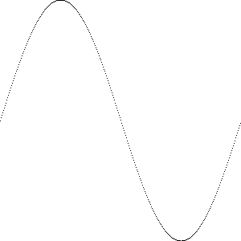

### Go语言输出正弦函数（Sin）图像

> Source Code

```go
package main

import (
	"image"
	"image/color"
	"image/png"
	"log"
	"math"
	"os"
)

func main() {
	// ------------------------------------------------------
	// 设置图片背景色
	// ------------------------------------------------------
	// 图片大小
	const size = 300

	// 根据给定的大小创建灰度图
	picture := image.NewGray(image.Rect(0, 0, size, size))

	// 遍历灰度图的所有像素，将每一个像素的灰度设为 255，也就是白色
	for x := 0; x < size; x++ {
		for y := 0; y < size; y++ {
			picture.SetGray(x, y, color.Gray{Y: 255})
		}
	}

	// ------------------------------------------------------
	// 绘制正弦函数轨迹
	// ------------------------------------------------------
	// 从0到最大像素生成x坐标
	for x := 0; x < size; x++ {
		// 让sin的值的范围在0~2Pi之前
		s := float64(x) * 2 * math.Pi / size

		// sin的幅度为一半的像素。向下偏移一半像素并翻转
		y := size/2 - math.Sin(s)*size/2

		// 用黑色绘制sin轨迹
		picture.SetGray(x, int(y), color.Gray{Y:0})
	}

	// ------------------------------------------------------
	// 写入图片文件
	// ------------------------------------------------------
	// 创建文件
	file, err := os.Create("./code/002/sin.png")
	if err != nil {
		log.Fatalf("os.Create error:%s\n", err)
	}

	// 关闭文件
	defer file.Close()

	// 使用PNG格式将数据写入文件(使用PNG包，将图形对象写入文件中)
	err = png.Encode(file, picture)
	if err != nil {
		log.Fatalf("png.Encode error:%s\n", err)
	}
}

```

> Output Effect


